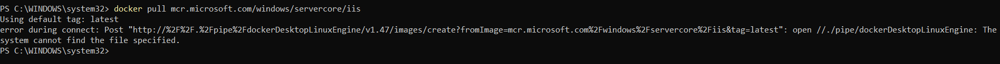
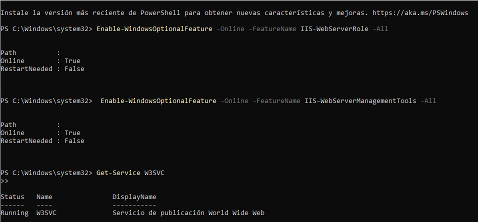
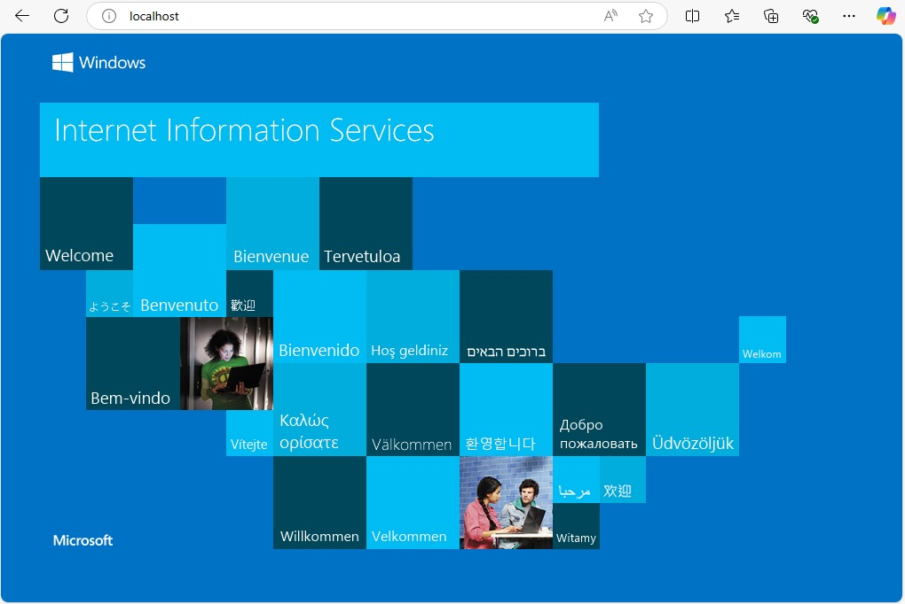
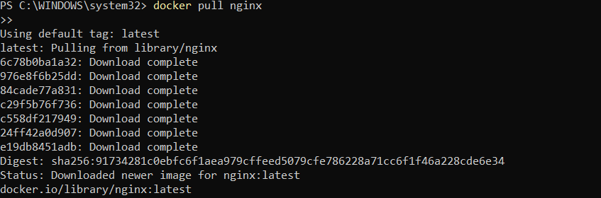
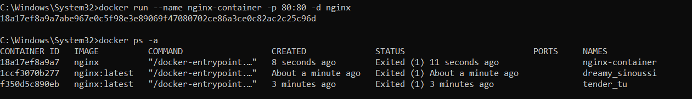

# Informe sobre la instalación de IIS con Docker en Windows 11 Home

## Contexto
La instalación de IIS (Internet Information Services) con Docker en un sistema operativo Windows permite crear un entorno de desarrollo y pruebas altamente funcional. Sin embargo, el soporte para contenedores de Windows varía según la edición de Windows, lo que puede generar limitaciones si no se cuenta con la versión adecuada. En este caso, se está utilizando Windows 11 Home, que presenta algunas restricciones en la configuración de contenedores de Windows.

## Requisitos previos

### Sistema operativo
- Windows 10 o Windows 11 Pro o Enterprise son necesarios para usar contenedores de Windows con Docker Desktop.
- Windows 11 Home no es compatible con la funcionalidad de contenedores de Windows, lo que impide realizar la instalación de IIS a través de Docker en esta edición.

### Docker Desktop
Es necesario tener instalado Docker Desktop en el sistema. Docker proporciona la infraestructura necesaria para ejecutar contenedores de aplicaciones, pero en este caso, Docker Desktop debe estar configurado para soportar contenedores de Windows (disponible solo en versiones de Windows Pro o Enterprise).

### Requisitos adicionales
- **WSL2 (Windows Subsystem for Linux 2)**: Debe estar habilitado para permitir la ejecución de contenedores de Linux.
- **Hyper-V**: Requiere que la funcionalidad de virtualización esté habilitada en la BIOS y en el sistema operativo.

## Pasos para la instalación de IIS con Docker

### 1. Abrir Docker
Asegúrate de tener Docker Desktop correctamente instalado y ejecutándose en tu máquina. Docker debe estar en funcionamiento antes de proceder con cualquier configuración.

### 2. Verificar la versión de Docker
Para confirmar que Docker está instalado y funcionando correctamente, abre una terminal y ejecuta el siguiente comando:

```bash
docker --version
```
Este comando mostrará la versión actual de Docker instalada en tu sistema. Asegúrate de estar utilizando una versión compatible con la ejecución de contenedores de Windows si tu sistema lo soporta.

### 3. Verificar la instalación de WSL2 y activación de Hyper-V

WSL2 (Windows Subsystem for Linux 2) es requerido para la ejecución de contenedores de Linux. Para habilitar WSL2 y Hyper-V, abre PowerShell como administrador y ejecuta los siguientes comandos:

```powershell
dism.exe /online /enable-feature /all /featurename:Microsoft-Hyper-V-All /featurename:VirtualMachinePlatform
```
Esto activará los servicios necesarios en Windows para la virtualización.

Para verificar que WSL2 está habilitado correctamente, ejecuta el siguiente comando:

```powershell
wsl --list --verbose
```
Esto mostrará los subsistemas de Linux instalados y su estado. Asegúrate de que WSL2 esté habilitado y en ejecución.

### 4. Cambiar a contenedores de Windows
En Docker Desktop, necesitas cambiar a contenedores de Windows para proceder con la instalación de IIS en el entorno adecuado. Para hacer esto, ejecuta el siguiente comando en Docker Desktop:

```bash
& 'C:\Program Files\Docker\Docker\DockerCli.exe' -SwitchDaemon
```
Este comando cambia el motor de Docker de contenedores de Linux a contenedores de Windows. Sin embargo, en sistemas Windows 11 Home, este paso genera un error debido a que Home no soporta la virtualización necesaria para ejecutar contenedores de Windows.



## Problema encontrado
En Windows 11 Home, no es posible cambiar a contenedores de Windows debido a la falta de soporte para la virtualización requerida. Este es un problema común en las ediciones Home de Windows, ya que Docker Desktop depende de Hyper-V y WSL2, tecnologías que no están completamente habilitadas en esta versión.

## Alternativas para continuar con la instalación

### 1. Trabajo en una máquina virtual
Se intentó realizar la instalación en una máquina virtual utilizando una imagen de Windows Pro. Sin embargo, la configuración de la máquina virtual presentó fallos, lo que impidió completar la instalación de IIS en el entorno virtual, debido a que para activar la virtualización se debe ingresar a la BIOS y, al ser una máquina virtual, no se pudo lograr.


### 2. Instalación sin Docker
Como alternativa, se decidió intentar la instalación de IIS directamente en Windows 11 Home sin usar Docker. Para ello, se utilizó el siguiente comando de PowerShell para instalar IIS y sus herramientas de administración:

```powershell
# Instalar el servidor web IIS
Enable-WindowsOptionalFeature -Online -FeatureName IIS-WebServerRole -All

# Instalar las herramientas de administración de IIS
Enable-WindowsOptionalFeature -Online -FeatureName IIS-WebServerManagementTools -All

# Verificar si el servicio de IIS está corriendo
Get-Service W3SVC
```
Este comando permite instalar IIS en el sistema operativo y habilitar las herramientas de administración necesarias para gestionar el servidor web.





### 3. Alternativa para Windows 11 Home - Usar NGINX
Dado que Windows 11 Home no permite la instalación de IIS con Docker, NGINX se presenta como una alternativa viable. NGINX es un servidor web ligero y eficiente que se puede instalar y configurar fácilmente en WSL2 sin las restricciones que presenta Docker en esta versión de Windows.

Para esta alternativa, se utilizó Docker para ejecutar un contenedor con NGINX, lo que permitió simular un entorno de servidor web sin depender de IIS. Al instalar NGINX en WSL2 y ejecutarlo mediante Docker, se pueden realizar trabajos similares a los que se harían con IIS, incluyendo la creación de servidores web locales. Esta opción es particularmente útil para aquellos que necesitan realizar pruebas de servidores web en un entorno controlado en Windows 11 Home.





## Conclusión
La instalación de IIS con Docker en Windows 11 Home presenta limitaciones debido a la falta de soporte para contenedores de Windows en esta versión del sistema operativo. Sin embargo, se han explorado diversas alternativas, como el uso de máquinas virtuales y la instalación directa de IIS sin Docker. También se recomienda utilizar NGINX en lugar de IIS en sistemas Home, ya que se adapta mejor a las capacidades de WSL2 y permite realizar trabajos similares de forma eficiente.

