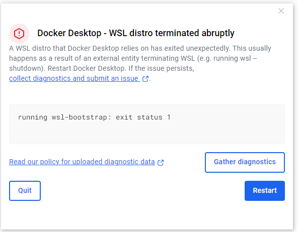

# Informe de Errores y Soluciones en Docker sobre Windows

## 1. Error: **Docker Desktop - WSL distro terminated abruptly**
### **Descripción**
Este error ocurre cuando la distribución de WSL utilizada por Docker se cierra inesperadamente, generalmente debido a que un proceso externo detuvo WSL.


### **Mensaje de error**
```
running wsl-bootstrap: exit status 1
```
